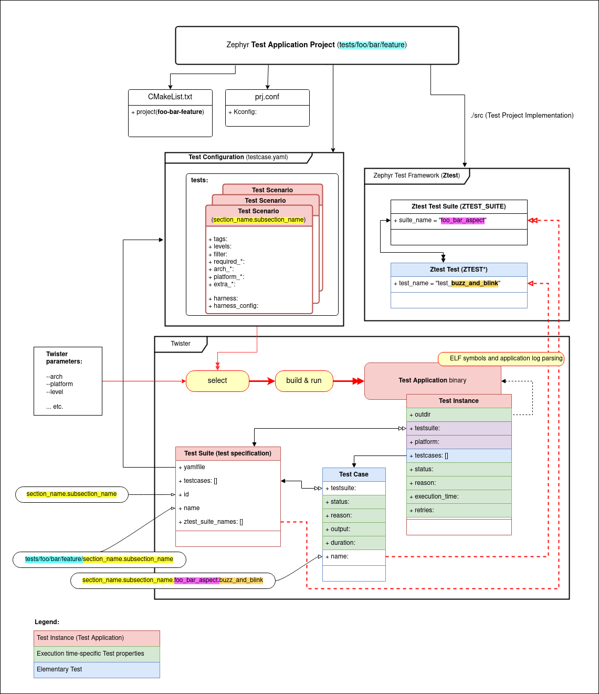
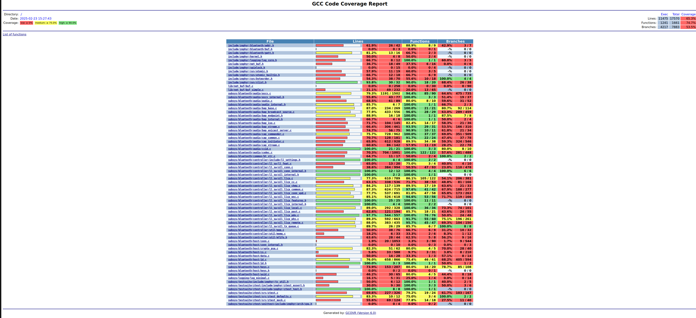
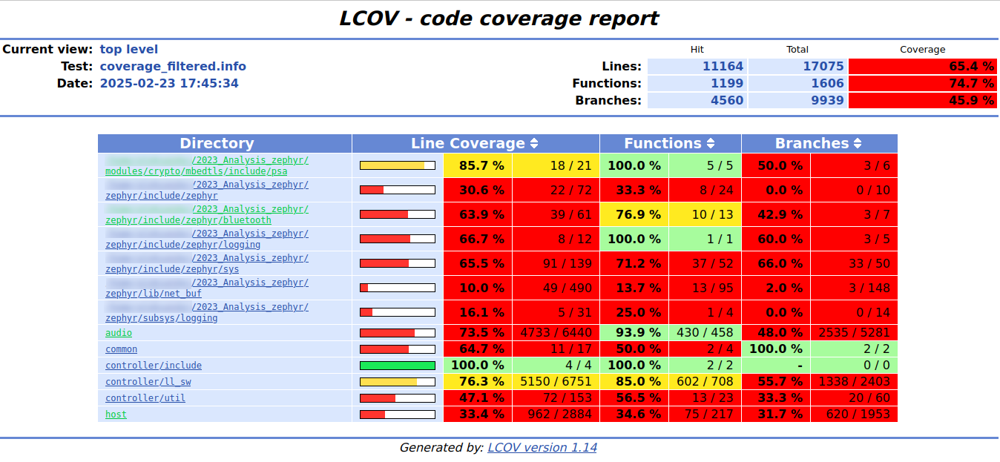
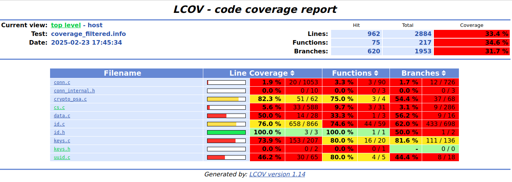
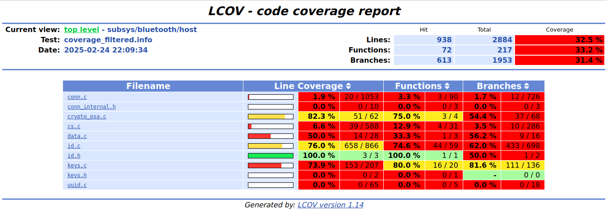
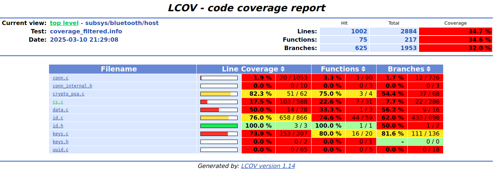
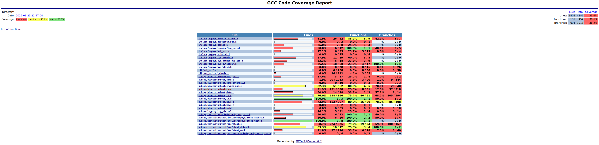

# Analysis of ZephyrOS real time operating system

--- 

## ZephyrOS

### Dynamic analysis

Dinamička analiza podrazumeva ispitivanje programa tokom njegovog izvršavanja. Za razliku od statičke analize koja radi sa izvornim kodom, dinamička analiza nam omogućava da:

* Proverimo stvarno ponašanje sistema u različitim scenarijima
* Identifikujemo greške koje se manifestuju samo tokom izvršavanja
* Izmerimo pokrivenost koda testovima

U kontekstu Zephyr projekta, fokusiramo se na jedinično testiranje modula za Bluetooth Channel Sounding funkcionalnost.

#### Unit tests

Jedinicno testiranje je jedan od nacina dinamickog testiranja koji se fokusira na ispitivanje ispravnosti najjednostavnijih celina koda. Kad govorimo o testiranju ispravnosti, bitno je napomenuti da se testiranjem mogu pronaci greske u implementaciji, ali uspesno izvrsavanje testova ne garantuje ispravnost jedinice u celini. Naravno, cilj je da imamo sto vecu moc otkrivanja gresaka, i jedan od alata koji nam u tome moze pomoci jeste i pracenje pokrivenosti koda testovima. Alat za pokrivenost koda bice podrobnije opisan u narednim odeljcima. Jedna od razlika u odnosu na integracione testove u kontekstu ZephyrOS projekta je cinjenica da se za testiranje jedne funkcije ne ukljucuje citav projekat, odnosno samo jedan modul se kompajlira sto znacajno ubrzava proces testiranja.

##### Twister

ZephyrOS pruza sopsveni alat za pokretanje jedinicnih testova - [twister](https://docs.zephyrproject.org/latest/develop/test/twister.html). Kako bi twister prepoznao testove, potrebno je organizovati kod testa na sledeci nacin:


```shell
.
├── CMakeLists.txt
├── prj.conf
├── src
│   ├── test_scenario_1.c
|   .
|   .
|   .
│   └── test_scenario_n.c
└── testcase.yaml
```

`testcase.yaml` je zapravo fajl koji govori alatu `twister` da se u okviru tog foldera nalaze testovi. U okviru tog fajla navodi se tip testa, platforma na kojoj treba da se izvrsava, i mnoge dodatne opcije za konfiguraciju testova o kojima nece biti reci ovde, vec su podrobno opisane u dokumentaciji. 

`CMakeLists.txt` 

`prj.conf` ukljucuje potrebne flag-ove (posebno kod integracionih testova) koji su potrebni za ukljucivanje raznih elemenata ZephyrOS operativnog sistema.

`src` folder sadrzi jedan ili vise fajlova u kojima su implementirani testovi.




##### Gcov

Jedna tehnika bez koje nema puno smisla pisanje jedinicnih testova jeste pracenje pokrivenosti koda testovima. U ovu svrhu koristi se alat gcovr koji generise graficki prikaz pokrivenosti izvornog koda, i to procentualno pokrivenost linija, funkcija i grananja. Pri odlucivanju da li je pokrivenost dovoljna, ne postoje jasno definisana pravila, s time sto je, naravno, veca pokrivenost pozeljnija. Jos jednom valja napomenuti da cak ni savrsena pokrivenost ne garantuje ispravnost programa, vec samo daje vecu pouzdanost (cak i ovde treba biti oprezan jer se velika pokrivenost moze postici i lose napisanim testovima) da se program ponasa ispravno u onim scenarijima za koje smo se setili napisati testove.

--- ;

#### Povecanje pokrivenosti - analiza

Kako bismo pristupili prosirenju implementiranih testova, ima smisla pokrenuti inicijalnu analizu pokrivenosti koda. Na osnovu tih rezultata, moze se odabrati modul koji ima (subjektivno odabranu) nezadovoljivu pokrivenost. Takodje, s obzirom na velicinu projekta koji se testira, ne bi bilo lose fokusirati sa na neki njegov podsistem. U nasem slucaju, odabracemo `bluetooth` podsistem.


Kako bismo imali pristup `twister` alatu, potrebno je da definisemo promenljive i podesimo putanje ka odgovarajucim zavisnostima. Ovo mozemo lako uraditi pozivom `source zephyr-env.sh` komande iz korenog direktorijuma ZephyrOS projekta. Dalje, kako bismo dobili inicijalnu pokrivenost pomenutog `bluetooth` podsistema, pokrecemo sledecu komandu:

`twister --coverage -p unit_testing -T tests/bluetooth/`

Dobijamo sledeci izlaz:

```shell
INFO    - Using Ninja..
INFO    - Zephyr version: v4.0.0-2878-g6f240ef18c11
INFO    - Using 'zephyr' toolchain.
INFO    - Building initial testsuite list...
INFO    - Writing JSON report /root_proj_path/zephyr/twister-out/testplan.json
INFO    - JOBS: 4
INFO    - Adding tasks to the queue...
INFO    - Added initial list of jobs to queue
INFO    - Total complete:  137/ 137  100%  built (not run):    0, filtered:    0, failed:    0, error:    0
INFO    - 305 test scenarios (137 configurations) selected, 0 configurations filtered (0 by static filter, 0 at runtime).
INFO    - 137 of 137 executed test configurations passed (100.00%), 0 built (not run), 0 failed, 0 errored, with no warnings in 799.44 seconds.
INFO    - 1777 of 1777 executed test cases passed (100.00%) on 1 out of total 901 platforms (0.11%).
INFO    - 340 selected test cases not executed: 340 skipped.
INFO    - 137 test configurations executed on platforms, 0 test configurations were only built.
INFO    - Generating coverage files...
INFO    - Using gcov tool: gcov
INFO    - HTML report generated: /root_proj_path/zephyr/twister-out/coverage/index.html
INFO    - Saving reports...
INFO    - Writing JSON report /root_proj_path/zephyr/twister-out/twister.json
INFO    - Writing xunit report /root_proj_path/zephyr/twister-out/twister.xml...
INFO    - Writing xunit report /root_proj_path/zephyr/twister-out/twister_report.xml...
INFO    - Run completed
```

Mozemo pogledati izvestaj otvaranjem generisane `index.html` stranice u bilo kom pretrazivacu.



Dakle, dobijamo sledece rezultate:

* Pokrivenost linija koda iznosi 65.3%
* Pokrivenost funkcija koda iznosi 74.7%
* Pokrivenost grananja u kodu iznosi 53.5%

Jos jedno zapazanje je da u izvestaju dobijamo i pokrivenost `subsys/testsuite` modula, sto nije nesto na sta zelimo da se fokusiramo. Da bismo ocistili izlaz od nezeljenih foldera, mozemo pokrenuti sledece komande:

`lcov --directory . --capture --output-file coverage.info --rc lcov_branch_coverage=1`

`lcov --remove coverage.info '*/subsys/testsuite/* --output-file coverage_filtered.info --rc lcov_branch_coverage=1`

`genhtml coverage_filtered.info --output-directory coverage_filtered --branch-coverage`

Nakon preciscavanja rezultata, dobijamo sledeci izvestaj:



Sam procenat pokrivenosti se nije puno promenio, ali je izvestaj sada relevantniji i moze se lakse odabrati ciljni modul za povecanje pokrivenosti. Modul koji deluje pogodno za poboljsanje je npr. `host` s obzirom da je jedan od modula sa najmanjom pokrivenoscu (oko 30% za linije, funkcije i grananja). Pogledajmo detaljnije gde ima mesta za konkretna poboljsanja otvaranjem izvestaja za pomenut modul:



Primecujemo da `conn.c` i `cs.c` fajlovi imaju poprilicno nisku pokrivenost a da su ujedno i nezanemarljive velicine (za razliku od `keys.h` i `conn_internal.h` koji takodje imaju veoma malu pokrivenost). Pogledajmo najpre postojecu infrastrukturu za testiranje modula `cs`:

```bash
ree zephyr/tests/bluetooth/host/cs/
zephyr/tests/bluetooth/host/cs/
├── bt_le_cs_parse_pct
│   ├── CMakeLists.txt
│   ├── prj.conf
│   ├── src
│   │   └── main.c
│   └── testcase.yaml
├── bt_le_cs_set_valid_chmap_bits
│   ├── CMakeLists.txt
│   ├── prj.conf
│   ├── src
│   │   └── main.c
│   └── testcase.yaml
├── bt_le_cs_step_data_parse
│   ├── CMakeLists.txt
│   ├── prj.conf
│   ├── src
│   │   └── main.c
│   └── testcase.yaml
└── mocks
    ├── CMakeLists.txt
    ├── conn.c
    ├── conn.h
    ├── hci_core.c
    ├── hci_core.h
    ├── net_buf.c
    └── net_buf.h

7 directories, 19 files
```

Vidimo da su testovi organizovani u zasebne foldere u zavisnosti od toga koju funkciju testiraju. U samom izvestaju (pracenjem linka ka `cs.c`) takodje vidimo da su pokrivene jedino funkcije `bt_le_cs_parse_pct`, `bt_le_cs_set_valid_chmap_bits` i `bt_le_cs_step_data_parse` - sto odgovara postojanju tri foldera izlistana gore. Ovo deluje kao dobro mesto za prosirenje testova, te cemo se fokusirati na to.

#### Povecanje pokrivenosti - implementacija

Pogledajmo najpre javni interfejs (`include/zephyr/bluetooth/cs.h`) da bismo locirali zanimljive funkcije za testiranje. Staticke funkcije necemo testirati ... TODO(avra): zasto. Pokusajmo najpre da dodamo testove za funkciju `bt_le_cs_security_enable` koja nije pokrivena u osnovnom slucaju. Prateci strukturu vec implementiranih testova, dodajemo folder sa testom za pomenutu funkciju na sledeci nacin:

```bash
zephyr/tests/bluetooth/host/cs/bt_le_cs_security_enable/
├── CMakeLists.txt      <-- Pravila za prevodjenje samog unit tests
├── mocks_unit_tests    <-- Folder sa mock bibliotekom
│   ├── CMakeLists.txt  <-- Pravila za prevodjenje mock biblioteke
│   ├── conn.c          <-- Mock definicija conn.c modula
│   ├── conn.h          <-- Mock deklaracija conn.h modula
│   ├── hci_core.c      <-- Mock definicija hci_core.c modula
│   ├── hci_core.h      <-- Mock deklaracija hci_core.h modula
│   ├── net_buf.c       <-- Mock definicija net_buf.c modula
│   └── net_buf.h       <-- Mock deklaracija net_buf.h modula
├── prj.conf            <-- Konfiguracija 'kernela' ZephyrOS-a
├── src
│   └── main.c          <-- Izvorni kod unit testa
└── testcase.yaml       <-- Definicija unit testa
```


Zarad lakseg pracenja koda, kopija ovog foldera ce se nalaziti na putanji `testing/unit/`, ali za samu integraciju u twister framework, neophodno je da folder bude prisutan u zephyr submodulu. Za ovo ce se pobrinuti skripta `run_tests.sh`, ali smatramo da je bitno napomenuti.

Komanda koju cemo koristiti za pokretanje unit testova uz generisanja izvestaja pokrivenosti je sledeca:

`twister --coverage -p unit_testing -T <putanja_do_testova_u_zephyr_submodulu> -v`

Twister generalno svoje izvrsavanja cuva u okviru foldera `twister-out.<broj_prethodnih_izvrsavanja>` (gde se `.<broj_prethodnih_izvrsavanja>` dodaje prilikom visestrukog pokretanja alata, i najskorije izvrsavanje se nalazi u `twister-out` folderu, dok se ranija cuvaju u `.<broj_prethodnih_izvrsavanja>` sa odgovarajucim brojem).

Nakon prevodjenja testa alatom `twister`, izvrsna datoteka se moze naci na putanji `/twister-out/unit_testing_unit_testing/tests/bluetooth/host/cs/bt_le_cs_security_enable/bluetooth.host.cs.bt_le_cs_security_enable/testbinary`.

Nakon pokretanja skripte, dobijamo sledeci izvestaj:



Dakle, povecali smo pokrivenost za 1%. U nastavku necemo navoditi medjurezultate pokrivenosti, vec ce biti dat krajnji rezultat nakon implementacije testova. Takodje, umesto dodavanja zasebnog foldera za svaku funkciju, grupisacemo unit testove u jedan veci folder (odvojen od inicijalnog) u koji cemo dodati sve testove zarad konciznosti.

Rezultati povecanja pokrivenosti koda nalaze se u folderu `tests/unit/channel_sounding`. Pokrili smo nekolicinu funkcija i povecali pokrivenost na 17% kao sto se vidi u izvestaju. Ovaj pristup, vodjen pokrivenoscu nije uvek najbolji alat za otkrivanje gresaka. Naime, u dosta funkcija je ocigledno na prvi pogled da nisu svi argumenti provereni odnosno da je moguce prosledjivanje NULL vrednosti. Ovo moze dovesti do nedefinisanog ponasanja i pucanja samog programa, i iako je pokrivenost za neku funkciju na primer potpuna, to ne znaci da smo ispravno koristili testove za validaciju programa. Iako pokrivenost koda jedinicnim testovima donosi vrednost u smislu provere za buduce modifikacije - jedinice bi trebalo da se ponasaju na isti nacin i u narednim iteracijama, testovi bi takodje trebalo da predstavljaju i vrstu dokumentacije, odnosno neki veid ugovora izmedju programera i korisnika sta se moze ocekivati prilikom koriscenja jedinice softvera.
Dakle, ima smisla udubiti se u kod i razmisljati na drugi nacin, odnosno ne samo u smeru povecanja pokrivenosti vec i u smeru otkrivanja gresaka. Pogledajmo neke od funkcija koje smo vec pokrili i ispitajmo kako se ponasaju u slucaju nepredvidjenih vrednosti.



#### Pisanje testova - otkrivanje gresaka

Kao sto smo vec spomenuli, mozemo se fokusirati na nekoliko funkcija za koje smo vec napisali testove. Za ovo cemo napraviti novi folder channel_sounding_behavior u koji cemo smestiti spomenuta prosirenja. Pogledajmo prvo `bt_le_cs_security_enable` funkciju i njeno ocekivano ponasanje. Funkcija pravi bafer HCI komande, popunjava ga sa pokazivacem na konekciju i salje komandu sinhrono. Vec smo pokrili tzv. happy path, odnosno slucaj u kome je sve kao sto ocekujemo. Uz to, testirali smo i slucaj u kome `bt_hci_cmd_create` funkcija vrati nepravilan bafer (NULL). Slucajevi koje bismo jos mogli pokriti jesu kada se kao pokazivac na konekciju prosledi NULL vrednost kao i slucaj kada `bt_hci_cmd_send_sync` funkcija pukne. Ova dva slucaja su pokrivena testovima `test_sec_enable_hci_cmd_fail_null_conn` i `test_sec_enable_cmd_send_fail`. Kompletna lista testova moze se videti u sekciji [implementirani testovi](#implementirani-testovi)

Pokrenimo najpre skriptu sa opcijom no-coverage posto ocekujemo da ovog puta nece svi testovi proci:

```bash
./run_tests.sh channel_sounding_behavior --no-coverage
```

Vec pri pokretanju skripte, vidimo da se javlja segmentation fault:

```bash
...
INFO    - 1/1 unit_testing/unit_testing tests/bluetooth/host/cs/channel_sounding_behavior/bluetooth.host.cs.channel_sounding_behavior FAILED Failed (rc=-11) (unit 0.334s)
ERROR   - see: path_to_test_results/build.log
...
INFO    - The following issues were found (showing the top 10 items):
INFO    - 1) tests/bluetooth/host/cs/channel_sounding_behavior/bluetooth.host.cs.channel_sounding_behavior on unit_testing/unit_testing failed (Failed (rc=-11))
...
```

Mozemo pokrenuti `gdb` debager sa putanjom `path_to_test_results` koju dobijemo pokretanjem skripte i potraziti razlog za ovo ponasanje:

```bash
gdb path_to_test_results/testbinary
...
(gdb) run
Starting program: path_to_test_results/testbinary
[Thread debugging using libthread_db enabled]
Using host libthread_db library "/lib/x86_64-linux-gnu/libthread_db.so.1".
Running TESTSUITE channel_sounding_tests
===================================================================
START - test_bt_le_cs_read_remote_supported_capabilities
Mock net_buf_simple_add called! len=2
 PASS - test_bt_le_cs_read_remote_supported_capabilities in 0.000 seconds
===================================================================
START - test_read_remote_fae_table
Mock net_buf_simple_add called! len=2
 PASS - test_read_remote_fae_table in 0.000 seconds
===================================================================
START - test_read_remote_supported_capabilities_complete
 PASS - test_read_remote_supported_capabilities_complete in 0.000 seconds
===================================================================
START - test_read_remote_supported_capabilities_complete_null_buf

Program received signal SIGSEGV, Segmentation fault.
0x56559e2e in bt_hci_le_cs_read_remote_supported_capabilities_complete (buf=0x0) at /home/aleksandar/2023_Analysis_zephyr/zephyr/subsys/bluetooth/host/cs.c:300
300             if (buf->len < sizeof(*evt)) {
```

Jasno je da se segmentation fault javlja zbog pristupa `NULL` memoriji u navedenom mestu u source kodu. Pre nego sto pristupimo popravci ovog propusta, napisacemo druge testove koji testiraju ponasanje funkcija u radu sa greskama, odnosno test `test_read_remote_supported_capabilities_complete_null_buf` cemo zakomentarisati i ponovo pokrenuti skriptu. Isto cemo uraditi i za test `test_read_remote_fae_table_null_conn`. Rezultat pokretanja dat je ispod:

```bash
Running TESTSUITE channel_sounding_tests
===================================================================
START - test_bt_le_cs_read_remote_supported_capabilities
Mock net_buf_simple_add called! len=2
 PASS - test_bt_le_cs_read_remote_supported_capabilities in 0.000 seconds
===================================================================
START - test_read_remote_fae_table
Mock net_buf_simple_add called! len=2
 PASS - test_read_remote_fae_table in 0.000 seconds
===================================================================
START - test_read_remote_supported_capabilities_complete
 PASS - test_read_remote_supported_capabilities_complete in 0.000 seconds
===================================================================
START - test_sec_enable_cmd_send_fail
Mock net_buf_simple_add called! len=2
 PASS - test_sec_enable_cmd_send_fail in 0.000 seconds
===================================================================
START - test_sec_enable_success
Mock net_buf_simple_add called! len=2
 PASS - test_sec_enable_success in 0.000 seconds
===================================================================
TESTSUITE channel_sounding_tests succeeded
Running TESTSUITE channel_sounding_tests_error_handling
===================================================================
START - test_read_remote_supported_capabilities_complete_conn_lookup_handle_fail
E: Could not lookup connection handle when reading remote CS capabilities
 PASS - test_read_remote_supported_capabilities_complete_conn_lookup_handle_fail in 0.000 seconds
===================================================================
START - test_read_remote_supported_capabilities_complete_evt_status_fail
W: Read Remote Supported Capabilities failed (status 0x01)
 PASS - test_read_remote_supported_capabilities_complete_evt_status_fail in 0.000 seconds
===================================================================
START - test_read_remote_supported_capabilities_complete_invalid_buf_len
E: Unexpected end of buffer
 PASS - test_read_remote_supported_capabilities_complete_invalid_buf_len in 0.000 seconds
===================================================================
START - test_sec_enable_hci_cmd_fail
 PASS - test_sec_enable_hci_cmd_fail in 0.000 seconds
===================================================================
START - test_sec_enable_hci_cmd_fail_null_conn

    Assertion failed at /home/aleksandar/2023_Analysis_zephyr/zephyr/tests/bluetooth/host/cs/channel_sounding_behavior/src/error_handling.c:60: channel_sounding_tests_error_handling_test_sec_enable_hci_cmd_fail_null_conn: bt_hci_cmd_create_fake.call_count not equal to 0

 at test function
 FAIL - test_sec_enable_hci_cmd_fail_null_conn in 0.000 seconds
===================================================================
TESTSUITE channel_sounding_tests_error_handling failed.

------ TESTSUITE SUMMARY START ------

SUITE PASS - 100.00% [channel_sounding_tests]: pass = 5, fail = 0, skip = 0, total = 5 duration = 0.000 seconds
 - PASS - [channel_sounding_tests.test_bt_le_cs_read_remote_supported_capabilities] duration = 0.000 seconds
 - PASS - [channel_sounding_tests.test_read_remote_fae_table] duration = 0.000 seconds
 - PASS - [channel_sounding_tests.test_read_remote_supported_capabilities_complete] duration = 0.000 seconds
 - PASS - [channel_sounding_tests.test_sec_enable_cmd_send_fail] duration = 0.000 seconds
 - PASS - [channel_sounding_tests.test_sec_enable_success] duration = 0.000 seconds

SUITE FAIL -  80.00% [channel_sounding_tests_error_handling]: pass = 4, fail = 1, skip = 0, total = 5 duration = 0.000 seconds
 - PASS - [channel_sounding_tests_error_handling.test_read_remote_supported_capabilities_complete_conn_lookup_handle_fail] duration = 0.000 seconds
 - PASS - [channel_sounding_tests_error_handling.test_read_remote_supported_capabilities_complete_evt_status_fail] duration = 0.000 seconds
 - PASS - [channel_sounding_tests_error_handling.test_read_remote_supported_capabilities_complete_invalid_buf_len] duration = 0.000 seconds
 - PASS - [channel_sounding_tests_error_handling.test_sec_enable_hci_cmd_fail] duration = 0.000 seconds
 - FAIL - [channel_sounding_tests_error_handling.test_sec_enable_hci_cmd_fail_null_conn] duration = 0.000 seconds

------ TESTSUITE SUMMARY END ------

===================================================================
PROJECT EXECUTION FAILED
```

Ovog puta nismo dobili veliki broj palih testova, ali dobijamo indikaciju da mozda treba obratiti paznju na baratanje neispravnim ulaznim vrednostima u funkcije.

Vidimo da nije svuda rigorozno proveravano da li se prosledjuju ispravne vrednosti, tako da cemo tu proveru dodati u izvorni kod i ponovo pokrenuti testove. Izmene koje su dodate ticu se uglavnom provere ulaznih argumenata funkcija i mogu se pogledati u `cs_error_handling.patch`. Nakon primene izmena, ponovo je pokrenuta skripta i vidimo da sada svi testovi prolaze. Mozemo nastaviti sa generisanjem izvestaja pokrivenosti za ispravljene testove. Krajnji rezultati pokrivenosti su prikazani na slici ispod:



## Implementirani testovi

### Testovi za `bt_le_cs_security_enable`

1. **`test_sec_enable_hci_cmd_fail`**  
   * Provera ponašanja kada `bt_hci_cmd_create` ne uspe (vrati NULL)  
   * Očekivano: Vraća `-ENOBUFS`  
   * ✅ **NAPOMENA**: Test je prolazio i pre izmena

2. **`test_sec_enable_hci_cmd_fail_null_conn`**  
   * Provera ponašanja sa NULL parametrom za konekciju  
   * Očekivano: Vraća `-ENOBUFS`  
   * ✅ **NAPOMENA**: Test je prolazio i pre izmena

3. **`test_sec_enable_cmd_send_fail`**  
   * Provera ponašanja kada `bt_hci_cmd_send_sync` ne uspe  
   * Očekivano: Vraća grešku sa sinhronizacije  
   * ✅ **NAPOMENA**: Test je prolazio i pre izmena

### Testovi za `bt_hci_le_cs_read_remote_supported_capabilities_complete`

4. **`test_read_remote_supported_capabilities_complete_null_buf`**  
   * Provera ponašanja sa NULL baferom  
   * Očekivano: Prekid bez operacija  
   * ✅ **NAPOMENA**: Test je prolazio i pre izmena

5. **`test_read_remote_supported_capabilities_complete_invalid_buf_len`**  
   * Provera ponašanja sa nevalidnom dužinom bafera  
   * Očekivano: Prekid izvršavanja  
   * :warning: **NAPOMENA**: Test nije prolazio pre izmena (nedostajala je provera dužine)

6. **`test_read_remote_supported_capabilities_complete_evt_status_fail`**  
   * Provera ponašanja kada status događaja pokazuje grešku  
   * Očekivano: Prekid izvršavanja  
   * ✅ **NAPOMENA**: Test je prolazio i pre izmena

7. **`test_read_remote_supported_capabilities_complete_conn_lookup_handle_fail`**  
   * Provera ponašanja kada pretraga konekcije ne uspe  
   * Očekivano: Prekid izvršavanja  
   * :warning: **NAPOMENA**: Test nije prolazio pre izmena (nedostajala je provera za NULL)

### Testovi za `bt_le_cs_read_remote_fae_table`

8. **`test_read_remote_fae_table_hci_cmd_fail`**  
   * Provera ponašanja kada kreiranje HCI komande ne uspe  
   * Očekivano: Vraća `-ENOBUFS`  
   * ✅ **NAPOMENA**: Test je prolazio i pre izmena

9. **`test_read_remote_fae_table_null_conn`**  
   * Provera ponašanja sa NULL parametrom za konekciju  
   * Očekivano: Vraća `-EFAULT`  
   * ✅ **NAPOMENA**: Test je prolazio i pre izmena

10. **`test_read_remote_fae_table_send_sync_failed`**  
    * Provera ponašanja kada sinhronizacija komande ne uspe  
    * Očekivano: Vraća grešku sa sinhronizacije  
    * ✅ **NAPOMENA**: Test je prolazio i pre izmena

### Testovi za `bt_hci_le_cs_read_remote_fae_table_complete`

11. **`test_bt_hci_le_cs_read_remote_fae_table_complete_invalid_buf_size_fail`**  
    * Provera ponašanja sa nevalidnom veličinom bafera  
    * Očekivano: Prekid izvršavanja  
    * :warning: **NAPOMENA**: Test nije prolazio pre izmena (nedostajala provera dužine)

12. **`test_bt_hci_le_cs_read_remote_fae_table_complete_evt_status_fail`**  
    * Provera ponašanja kada status događaja pokazuje grešku  
    * Očekivano: Prekid izvršavanja  
    * ✅ **NAPOMENA**: Test je prolazio i pre izmena

13. **`test_bt_hci_le_cs_read_remote_fae_table_complete_conn_lookup_fail`**  
    * Provera ponašanja kada pretraga konekcije ne uspe  
    * Očekivano: Prekid izvršavanja  
    * :warning: **NAPOMENA**: Test nije prolazio pre izmena (nedostajala provera za NULL)

_Napomena_: kod funkcija koje se zavrsavaju ranije ocekujemo da neke podfunkcije nikada nece biti pozvane. Ovaj uslov eksplicitno ukljucujemo u ocekivanja testa pomocu `zassert_` funkcija.

Navedeni testovi su implementirani u novom izvornom fajlu `error_handling.c`.


#### Integration tests

Limitations
Za razliku od testova jedinica koda, integracioni testovi testiraju ponasanje vise komponenti odjednom (ne nuzno jedinica koda). Dakle, za integraciono testiranje oslanjamo se na citave komponente (koje mogu biti unit testirane) i koriscenje mock i stub implementacija je manje, odnosno koriste se prave implementacije.

Primer implementiranog jednostavnog integracionog testa dat je u `samples/subsys/testsuite/integration` folderu (pogledati [Zephyr dokumentaciju](psa_set_key_usage_flags) za vise detalja). U implementaciji samog testa (u `main.c`) ne vidimo nista drasticno drugacije u odnosu na unit testove, tj. koriste se slicne funkcije za pretpostavke `zasser_`. Vecu razliku mozemo primetiti u okviru `testcase.yaml` fajla, gde se eksplicitno navode platforme za koje je dozvoljeno izvrsavanje testa:

```bash
platform_allow:
    - native_posix
    - native_sim
```

Ovo sledi iz cinjenice da koristimo prave implementacije modula, i da, ukoliko oni zavise od nekih hardverskih komponenti, moramo uzeti to u obzir i ograniciti izvrsavanje samo na one platforme koje hardverski podrzavaju module koje testiramo. Jos jedna napomena je da vidimo `build_only: true` direktivu. Ovo znaci da primer testa nije podoban za ispitivanje funkcionalnosti koda, vec da jedino proverava da li se kod prevodi. Jasno je da cemo ovu liniju izbaciti iz nase implementacije. Takodje nam je zanimljiva i sledeca konfiguracija:

```bash
integration_platforms:
    - native_sim
```

koja u ovom slucaju znaci da se, prilikom pokretanja `twister` alata sa opcijom `--integration`, testovi izvrsavaju samo na `native_sim` platformi. Naravno, moguce je dodati listu platformi na kojima ce se testovi izvrsavati.


#### Valgrind

Valgrind description.

Limitations in context of ZephyrOS and running natively on POSIX platform.

U ovom projektu bice korisceni sledeci valgrind alati:

* `memcheck`
* `callgrind`

##### valgrind memcheck

Alat memcheck pruza mogucnost analize koda u kontekstu bezbednog upravljanja memorijom. Postoji nekoliko kategorija potencijalnih problema sa memorijom. Najbitniji tipovi memorijskih gresaka opisani su ispod:

1) definitely lost - Memorija je alocirana i nikada nije oslobodjena, a pokazivac na tu memoriju je definitivno izgubljen i ne postoji nacin da mu program pristupi.
2) indirectly lost - Memorijski blok nije direktno izgubljen, ali zavisi od bloka memorije koji jeste izgubljen.
3) possibly lost - Memorijski blok je alociran, ali Valgrind ne moze da zakljuci da li je izgubljen.
4) still reachable - Memorjski blok je alociran i neoslobodjen, ali i dalje postoji pokazivac na njega.

TODO: opisati osnovne komande - odnosno skriptu

Nakon pokretanja memcheck alata nad jednostavnim primerom (`samples/bluetooth/beacon` pokrenut uz pomoc skripte `run_beacon_valgrind.sh`), vidimo da se greske vecinski ticu POSIX podsistema i funkcija koje nisu nuzno deo Zephyr OS-a. Naime, sve funkcije se zavrsavaju pozivom deljene biblioteke kojoj nemamo pristup u izvornom obliku.

```bash
==87752== Memcheck, a memory error detector
==87752== Copyright (C) 2002-2017, and GNU GPL'd, by Julian Seward et al.
==87752== Using Valgrind-3.18.1 and LibVEX; rerun with -h for copyright info
==87752== Command: ./build/zephyr/zephyr.exe --bt-dev=hci0
==87752== Parent PID: 87751
==87752== 
==87752== Thread 3:
==87752== Syscall param socketcall.bind(my_addr.rc_bdaddr) points to uninitialised byte(s)
==87752==    at 0x42924B2: bind (bind.c:32)
==87752==    by 0x80508D6: user_chan_open (userchan.c:344)
==87752==    by 0x80508D6: uc_open (userchan.c:388)
==87752==    by 0x804F5AE: bt_hci_open (bluetooth.h:127)
==87752==    by 0x804F5AE: bt_enable (hci_core.c:4360)
==87752==    by 0x8049B34: _posix_zephyr_main (main.c:105)
==87752==    by 0x80514F7: bg_thread_main (init.c:564)
==87752==    by 0x804A615: z_thread_entry (thread_entry.c:48)
==87752==    by 0x804BB21: posix_arch_thread_entry (thread.c:96)
==87752==    by 0x804BE4D: nct_thread_starter (nct.c:366)
==87752==    by 0x41F4C00: start_thread (pthread_create.c:442)
==87752==    by 0x428F309: clone (clone.S:107)
==87752==  Address 0x57a620c is on thread 3's stack
==87752==  in frame #1, created by uc_open (userchan.c:379)
==87752==  Uninitialised value was created by a stack allocation
==87752==    at 0x8050879: uc_open (userchan.c:379)
==87752== 
==87752== Syscall param socketcall.bind(my_addr.rc_channel) points to uninitialised byte(s)
==87752==    at 0x42924B2: bind (bind.c:32)
==87752==    by 0x80508D6: user_chan_open (userchan.c:344)
==87752==    by 0x80508D6: uc_open (userchan.c:388)
==87752==    by 0x804F5AE: bt_hci_open (bluetooth.h:127)
==87752==    by 0x804F5AE: bt_enable (hci_core.c:4360)
==87752==    by 0x8049B34: _posix_zephyr_main (main.c:105)
==87752==    by 0x80514F7: bg_thread_main (init.c:564)
==87752==    by 0x804A615: z_thread_entry (thread_entry.c:48)
==87752==    by 0x804BB21: posix_arch_thread_entry (thread.c:96)
==87752==    by 0x804BE4D: nct_thread_starter (nct.c:366)
==87752==    by 0x41F4C00: start_thread (pthread_create.c:442)
==87752==    by 0x428F309: clone (clone.S:107)
==87752==  Address 0x57a620e is on thread 3's stack
==87752==  in frame #1, created by uc_open (userchan.c:379)
==87752==  Uninitialised value was created by a stack allocation
==87752==    at 0x8050879: uc_open (userchan.c:379)
==87752== 
==87752== 
==87752== HEAP SUMMARY:
==87752==     in use at exit: 2,768 bytes in 7 blocks
==87752==   total heap usage: 18 allocs, 11 frees, 14,278 bytes allocated
==87752== 
==87752== Thread 1:
==87752== 80 bytes in 1 blocks are still reachable in loss record 1 of 7
==87752==    at 0x4048354: calloc (in /usr/libexec/valgrind/vgpreload_memcheck-x86-linux.so)
==87752==    by 0x804C208: nce_init (nce.c:60)
==87752==    by 0x804C8B1: posix_boot_cpu (soc.c:124)
==87752==    by 0x804D762: posix_init (main.c:80)
==87752==    by 0x804D78F: main (main.c:112)
==87752== 
==87752== 96 bytes in 1 blocks are still reachable in loss record 2 of 7
==87752==    at 0x4048354: calloc (in /usr/libexec/valgrind/vgpreload_memcheck-x86-linux.so)
==87752==    by 0x804C018: nct_init (nct.c:512)
==87752==    by 0x804BBB5: posix_arch_init (posix_core_nsi.c:23)
==87752==    by 0x804C8BB: posix_boot_cpu (soc.c:125)
==87752==    by 0x804D762: posix_init (main.c:80)
==87752==    by 0x804D78F: main (main.c:112)
==87752== 
==87752== 136 bytes in 1 blocks are possibly lost in loss record 3 of 7
==87752==    at 0x4048354: calloc (in /usr/libexec/valgrind/vgpreload_memcheck-x86-linux.so)
==87752==    by 0x4011D66: calloc (rtld-malloc.h:44)
==87752==    by 0x4011D66: allocate_dtv (dl-tls.c:375)
==87752==    by 0x4012823: _dl_allocate_tls (dl-tls.c:634)
==87752==    by 0x41F57F9: allocate_stack (allocatestack.c:430)
==87752==    by 0x41F57F9: pthread_create@@GLIBC_2.34 (pthread_create.c:647)
==87752==    by 0x804C322: nce_boot_cpu (nce.c:209)
==87752==    by 0x804C8CD: posix_boot_cpu (soc.c:126)
==87752==    by 0x804D762: posix_init (main.c:80)
==87752==    by 0x804D78F: main (main.c:112)
==87752== 
==87752== 136 bytes in 1 blocks are possibly lost in loss record 4 of 7
==87752==    at 0x4048354: calloc (in /usr/libexec/valgrind/vgpreload_memcheck-x86-linux.so)
==87752==    by 0x4011D66: calloc (rtld-malloc.h:44)
==87752==    by 0x4011D66: allocate_dtv (dl-tls.c:375)
==87752==    by 0x4012823: _dl_allocate_tls (dl-tls.c:634)
==87752==    by 0x41F57F9: allocate_stack (allocatestack.c:430)
==87752==    by 0x41F57F9: pthread_create@@GLIBC_2.34 (pthread_create.c:647)
==87752==    by 0x804BFEF: nct_new_thread (nct.c:476)
==87752==    by 0x804BC19: posix_new_thread (posix_core_nsi.c:48)
==87752==    by 0x804BAF9: arch_new_thread (thread.c:55)
==87752==    by 0x80521BC: z_setup_new_thread (thread.c:564)
==87752==    by 0x805154A: init_idle_thread (init.c:597)
==87752==    by 0x805154A: z_init_cpu (init.c:610)
==87752==    by 0x805160D: prepare_multithreading (init.c:681)
==87752==    by 0x805160D: z_cstart (init.c:795)
==87752==    by 0x804C17B: sw_wrapper (nce.c:184)
==87752==    by 0x41F4C00: start_thread (pthread_create.c:442)
==87752== 
==87752== 136 bytes in 1 blocks are possibly lost in loss record 5 of 7
==87752==    at 0x4048354: calloc (in /usr/libexec/valgrind/vgpreload_memcheck-x86-linux.so)
==87752==    by 0x4011D66: calloc (rtld-malloc.h:44)
==87752==    by 0x4011D66: allocate_dtv (dl-tls.c:375)
==87752==    by 0x4012823: _dl_allocate_tls (dl-tls.c:634)
==87752==    by 0x41F57F9: allocate_stack (allocatestack.c:430)
==87752==    by 0x41F57F9: pthread_create@@GLIBC_2.34 (pthread_create.c:647)
==87752==    by 0x804BFEF: nct_new_thread (nct.c:476)
==87752==    by 0x804BC19: posix_new_thread (posix_core_nsi.c:48)
==87752==    by 0x804BAF9: arch_new_thread (thread.c:55)
==87752==    by 0x80521BC: z_setup_new_thread (thread.c:564)
==87752==    by 0x8052210: z_impl_k_thread_create (thread.c:659)
==87752==    by 0x805202C: k_thread_create (kernel.h:85)
==87752==    by 0x805202C: k_work_queue_start (work.c:752)
==87752==    by 0x8051B71: k_sys_work_q_init (system_work_q.c:30)
==87752==    by 0x805142B: z_sys_init_run_level (init.c:371)
==87752== 
==87752== 136 bytes in 1 blocks are possibly lost in loss record 6 of 7
==87752==    at 0x4048354: calloc (in /usr/libexec/valgrind/vgpreload_memcheck-x86-linux.so)
==87752==    by 0x4011D66: calloc (rtld-malloc.h:44)
==87752==    by 0x4011D66: allocate_dtv (dl-tls.c:375)
==87752==    by 0x4012823: _dl_allocate_tls (dl-tls.c:634)
==87752==    by 0x41F57F9: allocate_stack (allocatestack.c:430)
==87752==    by 0x41F57F9: pthread_create@@GLIBC_2.34 (pthread_create.c:647)
==87752==    by 0x804BFEF: nct_new_thread (nct.c:476)
==87752==    by 0x804BC19: posix_new_thread (posix_core_nsi.c:48)
==87752==    by 0x804BAF9: arch_new_thread (thread.c:55)
==87752==    by 0x80521BC: z_setup_new_thread (thread.c:564)
==87752==    by 0x8052210: z_impl_k_thread_create (thread.c:659)
==87752==    by 0x8050986: k_thread_create (kernel.h:85)
==87752==    by 0x8050986: uc_open (userchan.c:397)
==87752==    by 0x804F5AE: bt_hci_open (bluetooth.h:127)
==87752==    by 0x804F5AE: bt_enable (hci_core.c:4360)
==87752==    by 0x8049B34: _posix_zephyr_main (main.c:105)
==87752== 
==87752== 2,048 bytes in 1 blocks are still reachable in loss record 7 of 7
==87752==    at 0x4048354: calloc (in /usr/libexec/valgrind/vgpreload_memcheck-x86-linux.so)
==87752==    by 0x804C084: nct_init (nct.c:524)
==87752==    by 0x804BBB5: posix_arch_init (posix_core_nsi.c:23)
==87752==    by 0x804C8BB: posix_boot_cpu (soc.c:125)
==87752==    by 0x804D762: posix_init (main.c:80)
==87752==    by 0x804D78F: main (main.c:112)
==87752== 
==87752== LEAK SUMMARY:
==87752==    definitely lost: 0 bytes in 0 blocks
==87752==    indirectly lost: 0 bytes in 0 blocks
==87752==      possibly lost: 544 bytes in 4 blocks
==87752==    still reachable: 2,224 bytes in 3 blocks
==87752==         suppressed: 0 bytes in 0 blocks
==87752== 
==87752== For lists of detected and suppressed errors, rerun with: -s
==87752== ERROR SUMMARY: 6 errors from 6 contexts (suppressed: 0 from 0)

```

Najveci broj bajtova koji su problematicni je `still reachable`. Ovo nije nuzno problem kao sto cemo videti ispod.

U svakom slucaju, probacemo da ispratimo call trace za neke od pronadjenih gresaka u okviru samog Zephyr OS sistema.
Jos jedno zapazanje je da se `main` funkcija ne smatra kao ulazna tacka za aplikaciju iskompajliranu za izvrsavanje na POSIX platformi. Naime, u fajlu `posix_cheats.h` vidimo da se main funkcija preimenuje u `_posix_zephyr_main` koja odgovara main funkciji u nasem primeru.

```c
/*
 * Normally main() is the main entry point of a C executable.
 * When compiling for native_posix, the Zephyr "application" is not the actual
 * entry point of the executable but something the Zephyr OS calls during
 * boot.
 * Therefore we need to rename this application main something else, so
 * we free the function name "main" for its normal purpose
 */
#ifndef main
#define main(...) _posix_zephyr_main(__VA_ARGS__)
#endif
```

Dalje, u `main.c` u okviru `native_posix` dobijamo jos jedno objasnjenje i nailazimo na istinski main od koga pocinje izvrsavanje:

```c
/**
 * This is the actual host process main routine.  The Zephyr
 * application's main() is renamed via preprocessor trickery to avoid
 * collisions.
 *
 * Not used when building fuzz cases, as libfuzzer has its own main()
 * and calls the "OS" through a per-case fuzz test entry point.
 */
int main(int argc, char *argv[])
{
    posix_init(argc, argv);
    while (true) {
        hwm_one_event();
    }

    /* This line should be unreachable */
    return 1; /* LCOV_EXCL_LINE */
}
```

Pracenjem stack-trace-a izvrsavanja u bloku_X dolazimo do funkcije nct_init u cijem opisu saznajemo da je greska koju je valgrind uhvatio ostavljena sa namerom jer je oslobadjanje memorije prepusteno host operativnom sistemu:

```c
/*
     * Note: This (and the calloc below) won't be free'd by this code
     * but left for the OS to clear at process end.
     * This is a conscious choice, see nct_clean_up() for more info.
     * If you got here due to valgrind's leak report, please use the
     * provided valgrind suppression file valgrind.supp
     */
```

Takodje vidimo da je izbor napravljen zarad osiguravanja pravilnog izvrsavanja na ustrb prijavljenih problema od strane valgrind-a:

```c
/**
 * Free any allocated memory by the threading emulator and clean up.
 * Note that this function cannot be called from a SW thread
 * (the CPU is assumed halted. Otherwise we would cancel ourselves)
 *
 * Note: This function cannot guarantee the threads will be cancelled before the HW
 * thread exists. The only way to do that, would be to wait for each of them in
 * a join without detaching them, but that could lead to locks in some
 * convoluted cases; as a call to this function can come due to a hosted OS
 * assert or other error termination, we better do not assume things are working fine.
 * => we prefer the supposed memory leak report from valgrind, and ensure we
 * will not hang.
 */
```

Poslusacemo savet u vezi koriscenja fajla za ignorisanje valgrind gresaka i pokrenuti analizu ispocetka. Dodajemo opciju `-s` za ukljucivanje supression fajla u `run_beacon_valgrind.sh` skriptu. _Za postizanje prvobitnog izlaza, pokrenuti skriptu bez ove opcije._

Sam suppression fajl navodi pravila za ignorisanje `reachable` i `possible` tipova gresaka koje smo videli u prvobitnom izlazu. Konkretno ignorisu se alokacije koje su nastale pozivima `posix_nex_thread` funkcija izmedju ostalih.

Izlaz iz ovako konfigurisane analize nam govori da su sve prijavljene greske u vezi alokacije bile izazvane konfiguracijom sistema za emulaciju. Pokusacemo i pokretanje aplikacije za babblesim platformu kasnije. Za sad, dobijamo prijavljene greske o koriscenju neinicijalizovane memorije. Nadalje cemo uvek uvlaciti fajl za suppression kako bismo se fokusirali samo na greske koje sama aplikacija moze izazvati.

```bash
==95865== Memcheck, a memory error detector
==95865== Copyright (C) 2002-2017, and GNU GPL'd, by Julian Seward et al.
==95865== Using Valgrind-3.18.1 and LibVEX; rerun with -h for copyright info
==95865== Command: ./build/zephyr/zephyr.exe --bt-dev=hci1
==95865== Parent PID: 95864
==95865== 
==95865== Thread 3:
==95865== Syscall param socketcall.bind(my_addr.rc_bdaddr) points to uninitialised byte(s)
==95865==    at 0x42924B2: bind (bind.c:32)
==95865==    by 0x8050743: user_chan_open (userchan.c:344)
==95865==    by 0x8050743: uc_open (userchan.c:388)
==95865==    by 0x804F432: bt_hci_open (bluetooth.h:127)
==95865==    by 0x804F432: bt_enable (hci_core.c:4360)
==95865==    by 0x8049AC9: _posix_zephyr_main (main.c:84)
==95865==    by 0x8051364: bg_thread_main (init.c:564)
==95865==    by 0x804A59A: z_thread_entry (thread_entry.c:48)
==95865==    by 0x804BAA6: posix_arch_thread_entry (thread.c:96)
==95865==    by 0x804BDD2: nct_thread_starter (nct.c:366)
==95865==    by 0x41F4C00: start_thread (pthread_create.c:442)
==95865==    by 0x428F309: clone (clone.S:107)
==95865==  Address 0x57a620c is on thread 3's stack
==95865==  in frame #1, created by uc_open (userchan.c:379)
==95865==  Uninitialised value was created by a stack allocation
==95865==    at 0x80506E6: uc_open (userchan.c:379)
==95865== 
==95865== Syscall param socketcall.bind(my_addr.rc_channel) points to uninitialised byte(s)
==95865==    at 0x42924B2: bind (bind.c:32)
==95865==    by 0x8050743: user_chan_open (userchan.c:344)
==95865==    by 0x8050743: uc_open (userchan.c:388)
==95865==    by 0x804F432: bt_hci_open (bluetooth.h:127)
==95865==    by 0x804F432: bt_enable (hci_core.c:4360)
==95865==    by 0x8049AC9: _posix_zephyr_main (main.c:84)
==95865==    by 0x8051364: bg_thread_main (init.c:564)
==95865==    by 0x804A59A: z_thread_entry (thread_entry.c:48)
==95865==    by 0x804BAA6: posix_arch_thread_entry (thread.c:96)
==95865==    by 0x804BDD2: nct_thread_starter (nct.c:366)
==95865==    by 0x41F4C00: start_thread (pthread_create.c:442)
==95865==    by 0x428F309: clone (clone.S:107)
==95865==  Address 0x57a620e is on thread 3's stack
==95865==  in frame #1, created by uc_open (userchan.c:379)
==95865==  Uninitialised value was created by a stack allocation
==95865==    at 0x80506E6: uc_open (userchan.c:379)
==95865== 
==95865== 
==95865== HEAP SUMMARY:
==95865==     in use at exit: 2,768 bytes in 7 blocks
==95865==   total heap usage: 18 allocs, 11 frees, 14,278 bytes allocated
==95865== 
==95865== LEAK SUMMARY:
==95865==    definitely lost: 0 bytes in 0 blocks
==95865==    indirectly lost: 0 bytes in 0 blocks
==95865==      possibly lost: 0 bytes in 0 blocks
==95865==    still reachable: 0 bytes in 0 blocks
==95865==         suppressed: 2,768 bytes in 7 blocks
==95865== 
==95865== For lists of detected and suppressed errors, rerun with: -s
==95865== ERROR SUMMARY: 2 errors from 2 contexts (suppressed: 4 from 4)
```

I dalje su prisutne greske u vezi pristupa neinicijalizovanoj memoriji u okviru `bind` sistemske funkcije. Istrazicemo fajl `userchan.c` u kome se poziva `bind` u okviru funkcije `user_chan_open()`. Na prvi pogled deluje da `bt_dev_index` nije eksplicitno inicijalizovana i da se oslanjamo na staticku alokaciju, odnosno da ce se vrednost promenljive automatski setovati na nulu. Dodatkom eksplicitne inicijalizacije, odnosno setovanjem na nulu, i dalje dobijamo istu gresku. Daljom analizom valgrind izlaza, vidimo da su greske prijavljene u poljima koja ne vidimo u okviru datog fajla. Primecujemo dalje da se velicine struktura `sockaddr_hci` i `sockaddr` ne poklapaju i imaju 6, odnosno 16 bajtova redom (izlaz ispod):

```c
    LOG_ERR("sizeof(sockaddr_hci) = %zu\n", sizeof(struct sockaddr_hci));
    LOG_ERR("sizeof(sockaddr) = %zu\n", sizeof(struct sockaddr));
```

```bash
[00:00:00.000,000] <err> bt_driver: sizeof(sockaddr_hci) = 6
[00:00:00.000,000] <err> bt_driver: sizeof(sockaddr_rc) = 16
```

Ovo neslaganje uz cinjenicu da se prijavljuju polja `rc_bdaddr` i `rc_channel` govori nam da funkcija `bind` najverovatnije prosledjenu strukturu tumaci na drugaciji nacin i da se polja zaista ne poklapaju. Umesto da promenljivu tipa `sockaddr_hci` tumacimo kao vecu promenljivu tipa `sockaddr`, mozemo napraviti promenljivu tipa `sockaddr` i popuniti joj odgovarajuca polja u okviru manje strukture. Ovako popunjenu strukturu prosledjujemo funkciji bind, i valgrind alat nam sada vise ne prikazuje greske:

```bash
==102663== Memcheck, a memory error detector
==102663== Copyright (C) 2002-2017, and GNU GPL'd, by Julian Seward et al.
==102663== Using Valgrind-3.18.1 and LibVEX; rerun with -h for copyright info
==102663== Command: ./build/zephyr/zephyr.exe --bt-dev=hci1
==102663== Parent PID: 102662
==102663== 
==102663== 
==102663== HEAP SUMMARY:
==102663==     in use at exit: 2,768 bytes in 7 blocks
==102663==   total heap usage: 18 allocs, 11 frees, 14,278 bytes allocated
==102663== 
==102663== LEAK SUMMARY:
==102663==    definitely lost: 0 bytes in 0 blocks
==102663==    indirectly lost: 0 bytes in 0 blocks
==102663==      possibly lost: 0 bytes in 0 blocks
==102663==    still reachable: 0 bytes in 0 blocks
==102663==         suppressed: 2,768 bytes in 7 blocks
==102663== 
==102663== For lists of detected and suppressed errors, rerun with: -s
==102663== ERROR SUMMARY: 0 errors from 0 contexts (suppressed: 4 from 4)
```

Izmene u izvornom kodu `userchan.c` date su u patchu `userchan_fix_uninit_access.patch`, dok je valgrind izlaz dat u fajlu `valgrind_20250209_183057_fixed_uninit.log`.


--- ;

 Kako bismo se uverili da valgrind zaista moze da uhvati greske prilikom inicijalizacije memorije, modifikovacemo prvi primer tako da se zaista vidi greska. Najpre cemo uvesti dve funkcije `mem_leak()` i `use_uninitialized_mem()` koje demonstriraju neoslobodjenu memoriju i koriscenje neinicijalizovane memorije redom. Ovu izmenu cuvamo u `memleak_demo_initial.patch`. Pri prvom pozivu alata valgrind na ovako izmenjenom izvornom kodu ne dobijamo nikakve nove greske. Ovo ponasanje moze biti prouzrokovano optimizacijama kompajlera, jer se u navedenim funkcijama ne desavaju nikakve znacajne izmene, pa ih kompajler izbacuje u potpunosti. Kako bismo izbegli ovo ponasanje, mozemo rucno iskljuciti optimizacije u okviru `prj.conf` fajla. Dodali smo `CONFIG_DEBUG=y` i `CONFIG_NO_OPTIMIZATIONS=y` u `prj.conf` i nakon pokretanja valgrind alata, mozemo videti da se sada prijavljuje 100 definitivno izgubljenih bajtova sto je i ocekivano jer smo alocirali memoriju bez da smo je oslobodili u `mem_leak()` funkciji. Dodatne izmene su u fajlu `memleak_demo_no_optimize.patch`, a valgrind izlaz je dat ispod:

 ```bash
 ==104210== Memcheck, a memory error detector
==104210== Copyright (C) 2002-2017, and GNU GPL'd, by Julian Seward et al.
==104210== Using Valgrind-3.18.1 and LibVEX; rerun with -h for copyright info
==104210== Command: ./build/zephyr/zephyr.exe --bt-dev=hci1
==104210== Parent PID: 104209
==104210== 
==104210== 
==104210== HEAP SUMMARY:
==104210==     in use at exit: 2,868 bytes in 8 blocks
==104210==   total heap usage: 20 allocs, 12 frees, 14,382 bytes allocated
==104210== 
==104210== 100 bytes in 1 blocks are definitely lost in loss record 3 of 8
==104210==    at 0x40436A0: malloc (in /usr/libexec/valgrind/vgpreload_memcheck-x86-linux.so)
==104210==    by 0x8049920: mem_leak (main.c:45)
==104210==    by 0x8049A9C: _posix_zephyr_main (main.c:96)
==104210==    by 0x805936A: bg_thread_main (init.c:564)
==104210==    by 0x804B2BB: z_thread_entry (thread_entry.c:48)
==104210==    by 0x804E4EC: posix_arch_thread_entry (thread.c:96)
==104210==    by 0x804EA11: nct_thread_starter (nct.c:366)
==104210==    by 0x41F4C00: start_thread (pthread_create.c:442)
==104210==    by 0x428F309: clone (clone.S:107)
==104210== 
==104210== LEAK SUMMARY:
==104210==    definitely lost: 100 bytes in 1 blocks
==104210==    indirectly lost: 0 bytes in 0 blocks
==104210==      possibly lost: 0 bytes in 0 blocks
==104210==    still reachable: 0 bytes in 0 blocks
==104210==         suppressed: 2,768 bytes in 7 blocks
==104210== 
==104210== For lists of detected and suppressed errors, rerun with: -s
==104210== ERROR SUMMARY: 1 errors from 1 contexts (suppressed: 4 from 4)
 ```

 Kao dodatak, napravicemo i primere za ostale tipove gresaka sa memorijom uvodjenjem sledecih funkcija:

 ```c
 typedef struct {
    char *data;
} Node;

void leak_indirectly() {
    Node *node = malloc(sizeof(Node)); // Allocated struct
    node->data = malloc(50);           // Allocated internal pointer

    // If `node` is lost, `node->data` is also lost (indirectly)
}
 ```


 ```c
void possibly_lost() {
    void *ptr = malloc(100);
    ptr = ptr - 5;  // Pointer is now shifted
}
 ```

 ```c
 void still_reachable() {
    static char *global_ptr;
    global_ptr = malloc(100);
}
 ```

Izmena se nalazi u fajlu `memleak_demo_all_leaks.patch`, a rezultati analize su u `valgrind_20250209_195054_all.log`. U rezultujucem fajlu vidimo da se prijavljuju ostali tipovi gresaka TODO(avra): opisati dalje...


--- ;

Kao sto je vec receno, probacemo i da iskompajliramo aplikaciju za `nrf52_bsim:` platformu. Za ovo je potrebno podesiti babblesim okruzenje (poblize opisano u README fajlu u valgrind folderu). Dakle, imamo simuliran fizicki sloj veze na koji se aplikacije mogu nakaciti. Skripta `run_ext_adv_valgrind.sh` najpre kompajlira scanner i advertiser aplikacije za nrf platformu, pokrece simulator fizickog sloja i nakon toga pokrece aplikacije pod valgrind alatom u zasebnim terminalima. Ponasanje aplikacija je sledece:

- advertiser pokrece servis za oglasavanje uz dozvoljeno konektovanje
- scanner trazi advertisement pakete i pokusava da se konektuje

U beskonacnoj petlji, advertiser ceka konekciju od strane scannera, i ukoliko se konekcija prekine, ponovo zapocinje oglasavanje. S druge strane, scanner trazi advertisera, ostvaruje konekciju i nakon TODO sekundi je resetuje. Ovo dobacivanje bi trajalo beskonacno dok eksterno ne prekinemo petlju, pa je stoga u skripte za pokretanje dodat `sleep` nakon koga se ubija trenutni proces (u svakoj skripti zasebno).

Nakon sto ubijemo aplikacije, i uz navedeni suppression fajl, vidimo da valgrind prijavljuje zanimljivije greske u odnosu na prethodne primere. Sazetak prijavljenih gresaka (advertiser) je dat ispod (puno ime fajla koriscenog u ovoj analizi je: `adv_scan/memcheck_advertiser/valgrind_20250219_233821.log`):

```bash
==28632== LEAK SUMMARY:
==28632==    definitely lost: 0 bytes in 0 blocks
==28632==    indirectly lost: 0 bytes in 0 blocks
==28632==      possibly lost: 1,532 bytes in 1 blocks
==28632==    still reachable: 536,058 bytes in 49 blocks
==28632==         suppressed: 2,784 bytes in 9 blocks
==28632== 
==28632== For lists of detected and suppressed errors, rerun with: -s
==28632== ERROR SUMMARY: 1 errors from 1 contexts (suppressed: 6 from 6)
```

Dakle, osim potisnutih gresaka, imamo `possibly lost` i `still reachable` bajtove memorije. Sledeci isecak iz izvestaja nas upucuje na `nsi_run_tasks` funkciju i `nsi_tasks.c` fajl:

```bash
==28632== 776 bytes in 1 blocks are still reachable in loss record 27 of 36
==28632==    at 0x40436A0: malloc (in /usr/libexec/valgrind/vgpreload_memcheck-x86-linux.so)
==28632==    by 0x80AAA19: bs_malloc (bs_oswrap.c:92)
==28632==    by 0x8096308: nhw_nvm_initialize_data_storage (NHW_NVM_backend.c:38)
==28632==    by 0x8096577: nhw_nvm_init_storage (NHW_NVM_backend.c:83)
==28632==    by 0x8095DE7: nhw_nvmc_uicr_init (NHW_NVMC.c:161)
==28632==    by 0x8092D77: nsi_run_tasks (nsi_tasks.c:39)
==28632==    by 0x80919C7: nsi_init (main.c:82)
==28632==    by 0x8091A11: main (main.c:119)
```

Primecujemo da u `NHW_NVM_backend.c` alociramo memoriju putem `bs_malloc` funkcije, ali deluje da se oslobadjanje memorije vrsi u drugoj funkciji, odnosno u `nhw_nvm_clear_storage`. U okviru `NHW_NVMC.c` fajla definisana je i funkcija za ciscenje memorije `nhw_nvmc_uicr_clean_up` i registrovana je putem `NSI_TASK` makroa: `NSI_TASK(nhw_nvmc_uicr_clean_up, ON_EXIT_PRE, 100);`. Ovo nam govori da bi funkcija za dealokaciju trebalo da se pozove prilikom kraja izvrsavanja, ali pre nego sto program return-uje (pogledati `native_simulator/common/src/nsi_tasks.h` za referencu). Dalje, pronalazimo `main` funkciju za native simulator, u okviru koje se definise funkcija `nsi_exit`, koja poziva `nsi_run_tasks`; odnosno izvrsava taskove koji su oznaceni sa `ON_EXIT_PRE` flag-om. U okviru dokumentacije za `native_sim` (dovoljno blisko nrf_bsim) navedeno je da se Zephyr jezgro ne zavrsava na kraju aplikacije, vec da se zapocinje beskonacna besposlena petlja. Dodaje se da se moze pozvati `nsi_exit` funkcija ukoliko zelimo da se aplikacija elegantno zavrsi. Dakle, ukoliko dodamo pomenutu funkciju, verujemo da ce i valgrind greske vezane za nsi taskove nestati. Izmene su date u `nsi_cleanup.patch`. Zaista, kada ponovo pokrenemo valgrind, vidimo da gotovo sve greske nestanu (osim onih suppressed). Izlaz je sacuvan u `valgrind_20250220_205835_patched.log`.

Analizirajmo izvorni kod ove dve aplikacije da se uverimo da dinamicko baratanje memorijom zaista radi na ispravan nacin. _Jos jedna napomena je da je ostavljena izmena u `userchan.c` prilikom izvrsenja ovog eksperimenta._ Dakle, u kodu vidimo da zaista nema dinamickog alociranja memorije, odnosno da nema mesta na kojima bi valgrind mogao naci gresku. Naime, jedino koriscenje pokazivaca je u `main.c` u kodu za `advertiser` i ta memorija se ...

Isto ponasanje je primeceno i kod heartrate aplikacije:

```bash
==40968== Memcheck, a memory error detector
==40968== Copyright (C) 2002-2017, and GNU GPL'd, by Julian Seward et al.
==40968== Using Valgrind-3.18.1 and LibVEX; rerun with -h for copyright info
==40968== Command: ./build/zephyr/zephyr.exe --bt-dev=hci2
==40968== Parent PID: 40967
==40968== 
==40968== 
==40968== HEAP SUMMARY:
==40968==     in use at exit: 3,040 bytes in 9 blocks
==40968==   total heap usage: 19 allocs, 10 frees, 8,270 bytes allocated
==40968== 
==40968== LEAK SUMMARY:
==40968==    definitely lost: 0 bytes in 0 blocks
==40968==    indirectly lost: 0 bytes in 0 blocks
==40968==      possibly lost: 0 bytes in 0 blocks
==40968==    still reachable: 0 bytes in 0 blocks
==40968==         suppressed: 3,040 bytes in 9 blocks
==40968== 
==40968== For lists of detected and suppressed errors, rerun with: -s
==40968== ERROR SUMMARY: 0 errors from 0 contexts (suppressed: 6 from 6)
```

Nisu pronadjene greske u okviru samog primera nad kojim smo vrsili testiranje, vec samo ocekivane greske koje su suppressed. U heartrate aplikaciji, rucnom analizom vidimo da nema puno mesta na kojima se koristi dinamicka alokacija memorije. Jedan pokazivac koji se koristi jeste pokazivac na strukturu `bt_le_ext_adv` koja se pri podrazumevanoj konfiguraciji ni ne koristi. Da bismo pokrili i slucaj prosirenog oglasavanja (`BT_EXT_ADV`), ukljucicemo `CONFIG_BT_EXT_ADV` flag tako sto cemo `west build` komandi proslediti overlay fajl koji prosiruje konfiguraciju pomenutim flag-om (`-- -DOVERLAY_CONFIG=$ZEPHYR_BASE/samples/bluetooth/peripheral_hr/overlay-extended.conf`). Krajnji izvestaj je identican prethodnom, tako da zakljucujemo da je primer bezbedno implementiran.

##### valgrind callgrind

--- ;

### Static analysis


#### Code styler
